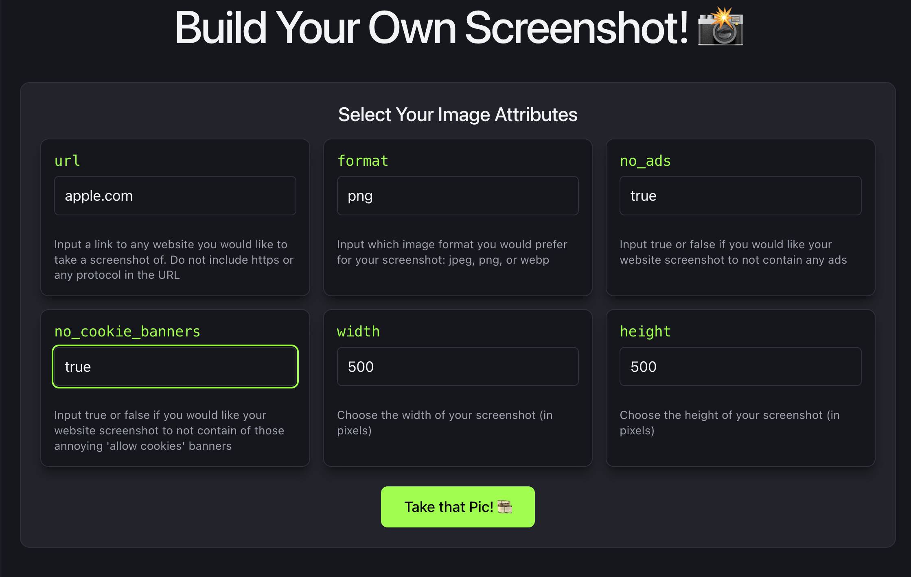
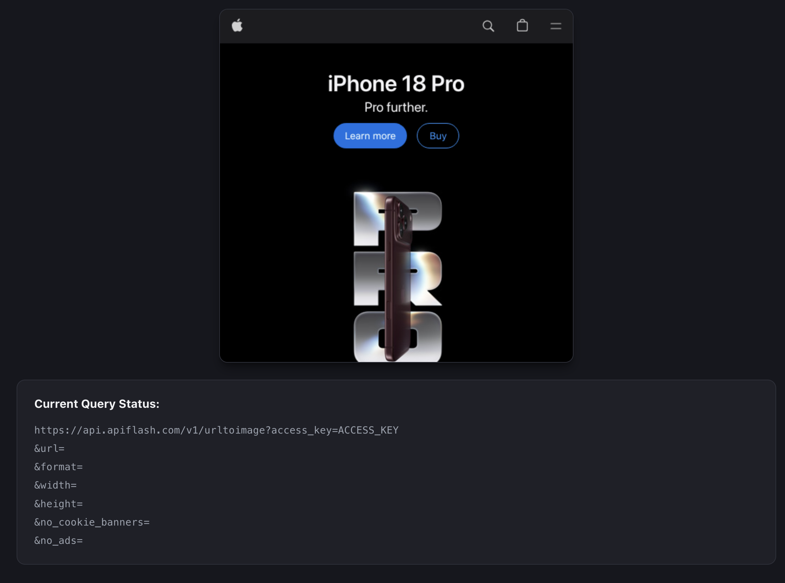
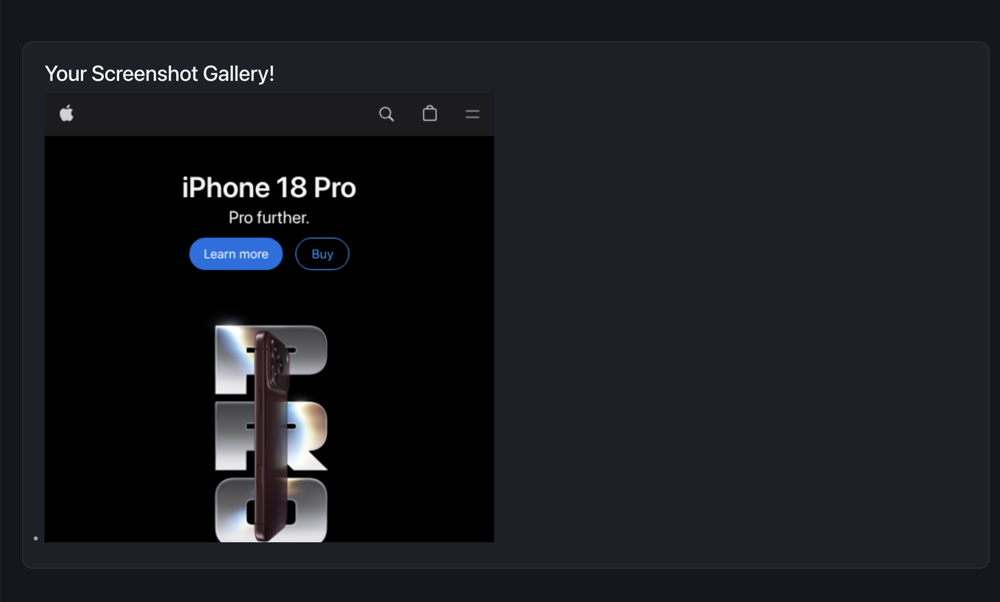

# Build Your Own Screenshot! 📸

A small React + Vite app that takes a website URL and a few options, then uses the [ApiFlash](https://apiflash.com/) API to capture and display a screenshot of that site.

## Features

- Form to set the screenshot attributes: `url`, `format`, `no_ads`, `no_cookie_banners`, `width`, `height`
- Blank fields fall back to defaults (`jpeg`, `true`, `true`, `1920`, `1080`)
- Live "Current Query Status" panel that mirrors your inputs as you type
- Alerts when the URL is missing or the API returns no screenshot
- Displays the returned screenshot and clears the form after a successful call

## Setup

1. Install dependencies:
   ```
   npm install
   ```
2. Create an account at [apiflash.com](https://apiflash.com/) and copy your access key.
3. Create a `.env` file in the project root (next to `package.json`):
   ```
   VITE_APP_ACCESS_KEY=your_apiflash_key
   ```
   Don't commit this file. Make sure `.env` is listed in `.gitignore`.
4. Start the dev server (restart it any time you change `.env`):
   ```
   npm run dev
   ```

## Usage

1. Enter a URL **without** the protocol, e.g. `example.com`.
2. Optionally fill in the other attributes, or leave them blank for the defaults.
3. Click **Take that Pic!**. The screenshot appears below the form.

## Screenshots

### Inputs



### Result



### Gallery



## Project structure

- [src/App.jsx](src/App.jsx): state, query building (`submitForm`, `makeQuery`), the API call (`callAPI`), and screenshot display
- [src/components/APIForm.jsx](src/components/APIForm.jsx): the input form and submit button

## Scripts

| Command           | Description                  |
| ----------------- | ---------------------------- |
| `npm run dev`     | Start the dev server         |
| `npm run build`   | Build for production         |
| `npm run preview` | Preview the production build |
| `npm run lint`    | Run ESLint                   |

## Built with

React 19, Vite, ApiFlash
